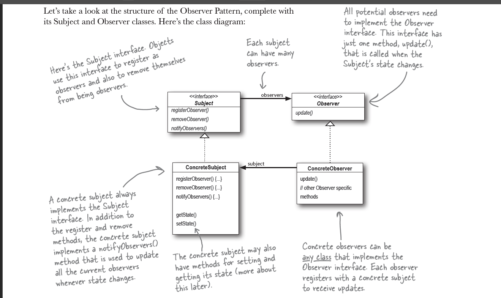

## Observer Pattern

Definition
: defines a one-to-may dependency between objects so that when one object change state, all of its dependents are notified and updated automatically.

### Class Diagram of the Observer Pattern

### Topis of this chapter

- loose coupling

### Design principle

- Strive for loosely coupled designs between objects that interact.
